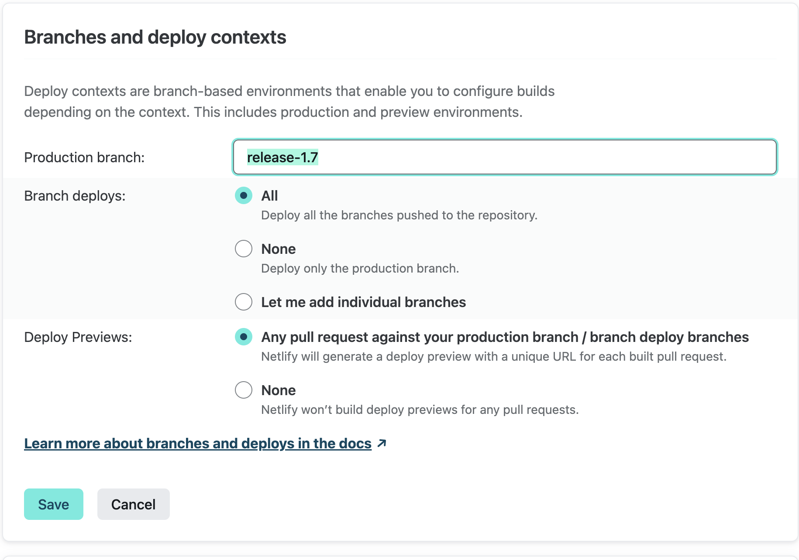

# CAPZ Releases

## Release Cadence

CAPZ minor versions (that is, 1.**5**.0 versus 1.**4**.x) are typically released every two months. In order to be practical and flexible, we will consider a more rapid minor release (for example, earlier than two months following the latest minor release) if any of the following conditions are true:

- Significant set of well-tested features introduced since the last release.
  - The guiding principle here is to avoid minor releases that introduce excess feature changes, to aid release testing and validation, and to allow users the option of adopting fewer changes when upgrading.
- User demand for rapid adoption of a specific feature or feature.

Additionally, we will consider delaying a minor release if no significant features have landed during the normal two-month release cycle.

CAPZ patch versions (for example, 1.5.**2** versus 1.5.**1**) are released as often as weekly. Each week at the open office hours meeting, maintainers decide whether or not a patch release is called for based on community input. A patch release may bypass this cadence if circumstances warrant.

## Release Support

The two most recent minor releases of CAPZ will be supported with bug fixes. Assuming minor releases arrive every two months on average, each minor release will receive fixes for four months.

For example, let's assume CAPZ v1.4.2 is the current release, and v1.3.2 is the latest in the previous minor release line. When v1.5.0 is released, it becomes the current release. v1.4.2 becomes the previous release line and remains supported. And v1.3.2 reaches end-of-life and no longer receives support through bug fixes.

Note that "support" in this context refers strictly to whether or not bug fixes are backported to a release line. Please see [the support documentation](https://github.com/kubernetes-sigs/cluster-api-provider-azure/blob/main/SUPPORT.md) for more general information about how to get help with CAPZ.

### Bug Fixes and Test Improvements

Any significant user-facing bug fix that lands in the `main` branch should be backported to the current and previous release lines. Security-related fixes are automatically considered significant and user-facing.

Improvements or significant changes to tests should be backported to the current release line. This is intended to minimize friction in the event of a critical test fix. Test improvements or changes may sometimes need to be backported to the previous release line in the event that tests break on all release branches.

### Experimental API Changes

Experimental Cluster API features (for example, `AzureManagedCluster`) may evolve more rapidly than graduated v1 features. CAPZ allows general changes, enhancements, or additions in this area to be cherry-picked into the current release branch for inclusion in patch releases. This will accelerate the effort to graduate experimental features to the stable API by allowing faster adoption and iteration.

Breaking changes are also allowed in experimental APIs; those changes will not be included in a patch release, but will be introduced in a new minor release, with appropriate release notes.

### Timing of Merges

Sometimes pull requests touch a large number of files and are more likely to create challenges for the automated cherry-pick process. In such cases, maintainers may prefer to delay merging such changes until the end of a minor release cycle.

## Release Process

The release process can be assisted by any contributor, but requires some specific steps to be be done by a maintainer as shown by (maintainer) to the right of the step title. The process is as follows:

### 1. Update main metadata.yaml (skip for patch releases)

- Make sure the [metadata.yaml](https://github.com/kubernetes-sigs/cluster-api-provider-azure/blob/main/metadata.yaml) file in the root of the project is up to date and contains the new release with the correct cluster-api contract version.
  - If not, open a [PR](https://github.com/kubernetes-sigs/cluster-api-provider-azure/pull/1928) to add it.

This must be done prior to generating release artifacts, so the release contains the correct metadata information for `clusterctl` to use.

### 2. Change milestone (skip for patch releases) (maintainer)

- Create a [new GitHub milestone](https://github.com/kubernetes-sigs/cluster-api-provider-azure/milestones/new) for the next release.
- Change the milestone applier so new changes can be applied to the appropriate release.

#### Versioning

cluster-api-provider-azure follows the [semantic versionining][semver] specification.

Example versions:

- Pre-release: `v0.1.1-alpha.1`
- Minor release: `v0.1.0`
- Patch release: `v0.1.1`
- Major release: `v1.0.0`


### 3. Open a PR for release notes

1. If you don't have a GitHub token, create one by going to your GitHub settings, in [Personal access tokens](https://github.com/settings/tokens). Make sure you give the token the `repo` scope.  If you would like the next step (promote image) to automatically create a PR from your fork, then the token will also need pull request permissions, else you can create the PR manually.

1. Fetch the latest changes from upstream and check out the `main` branch:

    ```sh
    git fetch upstream
    git checkout main
    ```

1. Generate release notes by running the following commands on the `main` branch:

    ```sh
    export GITHUB_TOKEN=<your GH token>
    export RELEASE_TAG=v1.2.3 # change this to the tag of the release to be cut
    make release-notes
    ```

1. Review the release notes file generated at `CHANGELOG/<RELEASE_TAG>.md` and make any necessary changes:

    - Move items out of "Uncategorized" into an appropriate section.
    - Change anything attributed to "k8s-cherrypick-robot" to credit the original author.
    - Fix any typos or other errors.
    - Add a "Details" section with a link to the full diff:
        ```md
        ## Details
        <!-- markdown-link-check-disable-next-line -->
        https://github.com/kubernetes-sigs/cluster-api-provider-azure/compare/v1.14.4...v1.14.5
        ```
      Be sure to replace the versions in the URL with the appropriate tags.

1. Open a pull request against the `main` branch with the release notes.

Merging the PR will automatically trigger a [Github Action](https://github.com/kubernetes-sigs/cluster-api-provider-azure/actions) to create a release branch (if needed), push a tag, and publish a draft release.

### 4. Promote image to prod repo

- Images are built by the [post push images job](https://testgrid.k8s.io/sig-cluster-lifecycle-cluster-api-provider-azure#post-cluster-api-provider-azure-push-images). This will push the image to a [staging repository][staging-repository].
- Wait for the above job to complete for the tag commit and for the image to exist in the staging directory, then create a PR to promote the image and tag. Assuming you're on the `main` branch and that `$RELEASE_TAG` is still set in your environment:
  - `make promote-images`

This will automatically create a PR in [k8s.io](https://github.com/kubernetes/k8s.io) and assign the CAPZ maintainers. (See an [example PR](https://github.com/kubernetes/k8s.io/pull/4284).)  If the GITHUB_TOKEN doesn't have permissions for PR, it should still create the branch and code then a manual PR can be created.

<aside class="note warning">
<h1> Note </h1>
<code class="hjls">make promote-images</code> assumes your git remote entries are using <code class="hjls">https://</code> URLs. Using <code class="hjls">git@</code> URLs will cause the command to fail and instead manually change the <a  href="https://github.com/kubernetes-sigs/cluster-api-provider-azure/blob/8cb43376223b1a3b2634215de38182e0068ebb04/Makefile#L590"> USER_FORK </a> value in the Makefile to your forked root repository URL e.g. 'dtzar'.
</aside>

### 5. Review and approve promoted prod image (maintainer)

For reviewers of the above-created PR, to confirm that the resultant image SHA-to-tag addition is valid, you can check against the [staging repository][staging-repository].

Using [the above example PR](https://github.com/kubernetes/k8s.io/pull/4284), to verify that the image identified by SHA `d0636fad7f4ced58b5385615a53b7cb2053f79c4788bd299e0ac9e46a25b5053` has the expected `v1.4.3`, tag, you would inspect the image metadata by viewing it in the Google Container Registry UI:

- https://console.cloud.google.com/gcr/images/k8s-staging-cluster-api-azure/global/cluster-api-azure-controller@sha256:d0636fad7f4ced58b5385615a53b7cb2053f79c4788bd299e0ac9e46a25b5053

### 6. Release in GitHub (maintainer)

- Proofread the GitHub release content and fix any remaining errors. (This is copied from the release notes generated earlier.) If you made changes, save it as a draft–don't publish it yet.
- Ensure that the promoted release image is live:

    ```sh
    docker pull registry.k8s.io/cluster-api-azure/cluster-api-azure-controller:${RELEASE_TAG}
    ```

    Don't move on to the next step until the above command succeeds.
- Check expected artifacts

    1. A release yaml file `infrastructure-components.yaml` containing the resources needed to deploy to Kubernetes
    2. A `cluster-templates.yaml` for each supported flavor
    3. A `metadata.yaml` which maps release series to cluster-api contract version
    4. Release notes

- Publish the release in GitHub. Check `Set as the latest release` if appropriate.

### 7. Update docs (skip for patch releases) (maintainer)

Go to [the Netlify branches and deploy contexts in site settings](https://app.netlify.com/sites/kubernetes-sigs-cluster-api-provider-azure/settings/deploys#branches-and-deploy-contexts) and click "edit settings". Update the "Production branch" to the new release branch and click "Save". The, go to the [Netlify site deploys](https://app.netlify.com/sites/kubernetes-sigs-cluster-api-provider-azure/deploys) and trigger a new deploy.



Note: this step requires access to the Netlify site. If you don't have access, please ask a maintainer to update the branch.

### 8. Announce the new release

#### Patch Releases

1. Announce the release in Kubernetes Slack on the [#cluster-api-azure](https://kubernetes.slack.com/archives/CEX9HENG7) channel.

#### Minor/Major Releases

1. Follow the communications process for [pre-releases](#pre-releases)
2. An announcement email is sent to `kubernetes-sig-azure@googlegroups.com` and `kubernetes-sig-cluster-lifecycle@googlegroups.com` with the subject `[ANNOUNCE] cluster-api-provider-azure <version> has been released`

[semver]: https://semver.org/#semantic-versioning-200
[template]: /docs/release-notes-template.md
[versioning]: #versioning
[staging-repository]: https://console.cloud.google.com/gcr/images/k8s-staging-cluster-api-azure/GLOBAL/cluster-api-azure-controller?rImageListsize=30

## Post release steps (maintainer)

  - Open a PR in https://github.com/kubernetes/test-infra to change [this line](https://github.com/kubernetes/test-infra/blob/25db54eb9d52e08c16b3601726d8f154f8741025/config/prow/plugins.yaml#L344).
    - See an [example PR](https://github.com/kubernetes/test-infra/pull/16827).

### Update test provider versions (skip for patch releases)

This can be done in parallel with release publishing and does not impact the release or its artifacts.

#### Update test metadata.yaml

Using that same next release version used to create a new milestone, update the the CAPZ provider [metadata.yaml](https://github.com/kubernetes-sigs/cluster-api-provider-azure/blob/main/test/e2e/data/shared/v1beta1_provider/metadata.yaml) that we use to run PR and periodic cluster E2E tests against the main branch templates. (This `metadata.yaml` is in the `test/e2e/data/shared/v1beta1_provider` directory; it's not the one in the project's root that we edited earlier.)

For example, if the latest stable API version of CAPZ that we run E2E tests against is `v1beta`, and we're releasing `v1.12.0`, and our next release version is `v1.13.0`, then we want to ensure that the `metadata.yaml` defines a contract between `v1.13.0` and `v1beta1`:

```yaml
apiVersion: clusterctl.cluster.x-k8s.io/v1alpha3
releaseSeries:
  - major: 1
    minor: 11
    contract: v1beta1
  - major: 1
    minor: 12
    contract: v1beta1
  - major: 1
    minor: 13
    contract: v1beta1
```

Additionally, we need to update the `type: InfrastructureProvider` spec in [azure-dev.yaml](https://github.com/kubernetes-sigs/cluster-api-provider-azure/blob/main/test/e2e/config/azure-dev.yaml) to express that our intent is to test (using the above example) `1.13`. By convention we use a sentinel patch version "99" to express "any patch version". In this example we want to look for the `type: InfrastructureProvider` with a `name` value of `v1.12.99` and update it to `v1.13.99`:

```yaml
    - name: v1.13.99 # "vNext"; use manifests from local source files
```

#### Update clusterctl API version upgrade tests

Update the provider versions for the [API version upgrade tests](https://github.com/kubernetes-sigs/cluster-api-provider-azure/blob/v1.16.0/test/e2e/common.go#L94-L95) to use the latest patch release of the previous two minor releases. See [this PR](https://github.com/kubernetes-sigs/cluster-api-provider-azure/pull/4873) for more details.

The two versioned prow templates within `test/e2e/data/infrastructure-azure` should be updated to `templates/test/ci/cluster-template-prow.yaml` at the respective version. For example, if we're updating `v1.14.4` to `v1.14.5`, then `cluster-template-prow.yaml` should be moved from `test/e2e/data/infrastructure-azure/v1.14.4` to `test/e2e/data/infrastructure-azure/v1.14.5`, and contain the same contents as `templates/test/ci/cluster-template-prow.yaml`. 

### Update Upstream Tests (skip for patch releases)

For major and minor releases we will need to update the set of capz-dependent `test-infra` jobs so that they use our latest release branch. For example, if we cut a new `1.3.0` minor release, from a newly created `release-1.3` git branch, then we need to update all test jobs to use capz at `release-1.3` instead of `release-1.2`.

Here is a reference PR that applied the required test job changes following the `1.3.0` minor release described above:

- [Reference test-infra PR](https://github.com/kubernetes/test-infra/pull/26200)

#### Roadmap (maintainer)

Consider whether anything should be updated in the [roadmap document](../roadmap.md) by answering the following questions:

1. Have any of the Epics listed been entirely or largely achieved?  If so, then the Epic should likely be removed and highlighted during the release communications.
2. Are there any new Epics we want to highlight?  If so, then consider opening a PR to add them and bringing them up in the next office hours planning meeting with the milestone review.
3. Have any updates to the roadmap document occurred in the past 6 months?  If not, it should be updated in some form.

If any changes need to be made, it should not block the release itself.
