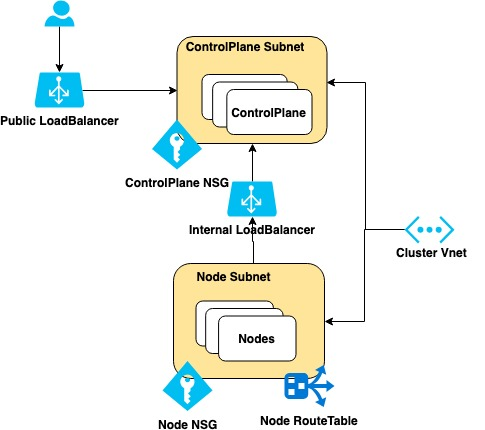

# Cluster API Provider Azure Design<!-- omit in toc -->

## Folder Structure

- /pkg/cloud/azure/apis - contains the crds
- /pkg/cloud/azure
  - /pkg/cloud/azure/actuators/cluster - cluster actuator for cluster api provider
  - /pkg/cloud/azure/actuators/machine - machine actuator for cluster api provider
  - /pkg/cloud/azure/services - each folder represents an azure service, implements Get/CreateOrUpdate/Delete
  - /pkg/cloud/azure/services/config - contains startup scripts for controlplane and worker nodes

## Components

### Cluster Actuator

The cluster actuator creates the following resources, in order:
- Certificates (generating using the kubeadm packages):
    - Kubernetes Certificate Authority (CA)
    - API server (includes public IP FQDN as a certificate SAN (subject alternative name))
    - front proxy
    - SA (Service account)
    - Admin kubeconfig
    - kubeadm discovery hashes (required for bootstrapping)
- Azure networking components (zone-redundant, by default)
    - (1) virtual network
    - (2) subnets
      - control plane
      - node
    - (2) NSG (network security groups)
      - control plane
      - node
    - (1) route table (node)
    - (1) public IP (Standard SKU)
    - (1) public load balancer (Standard SKU, attached to public IP)
   - (1) internal load balancer (Standard SKU, for communication from worker nodes)

### Machine Actuator

The machine actuator creates Kubernetes nodes, according to the supplied `machines.yaml`, within the above Azure network infrastructure, in the following order:
- NIC (network interface card)
- virtual machine (created in an Azure Availability Zone, in regions where AZs are supported)
- kubeadm bootstrap token (if required)
- generated startup script (to be used by Azure Custom Script Extension)
