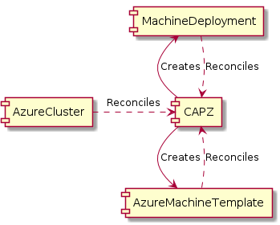

# Use Machine Deployments to bootstrap bastion VMs for SSH/RDP access to k8s nodes.

## Table of Contents

* [Use Machine Deployments to bootstrap bastion VMs for SSH/RDP access to k8s nodes.](#use-machine-deployments-to-bootstrap-bastion-vms-for-sshrdp-access-to-k8s-nodes)
  * [Table of Contents](#table-of-contents)
  * [Glossary](#glossary)
  * [Summary](#summary)
  * [Motivation](#motivation)
    * [Goals](#goals)
    * [Non-Goals/Future Work](#non-goalsfuture-work)
  * [Proposal](#proposal)
    * [User Stories](#user-stories)
      * [Story 1](#story-1)
      * [Functional Requirements](#functional-requirements)
      * [Non-Functional Requirements](#non-functional-requirements)
    * [Implementation Details/Notes/Constraints](#implementation-detailsnotesconstraints)
      * [Existing APIs for Clarity](#existing-apis-for-clarity)
      * [Proposed API Changes](#proposed-api-changes)
  * [Conclusions](#conclusions)
  * [Additional Details](#additional-details)
    * [Test Plan](#test-plan)
  * [Implementation History](#implementation-history)


## Glossary

* CAPZ - An abbreviation of Cluster API Provider Azure.
* KISS - Keep It Simple, Stupid (see [Wikipedia](https://en.wikipedia.org/wiki/KISS_principle))

## Summary

Accessing virtual machines forming a Kubernetes cluster for administrative purposes is a potential security threat.
A common pattern to provide SSH/RDP access to virtual machines without exposing them to the public internet is to use 
a `Bastion host` or `Jump host`, a dedicated machine that is exposed to the internet acting as a bridge between the administrators'
computers and the Kubernetes nodes (that can therefore stay behind a firewall).
This CAEP aims at providing a way to bootstrap `Bastion Hosts` in a CAPZ cluster leveraging existing Controllers as much as possible
by reusing CRDs like `MachineDeployment` and `AzureMachineTemplate`.

## Motivation

By default, CAPZ clusters expose one of the control plane nodes to the internet making it possible to access all the other nodes in the cluster via SSH or RDP.

As an alternative, it is possible to use the [`AzureBastion`](https://azure.microsoft.com/en-us/services/azure-bastion/) feature to SSH/RDP to nodes using a web interface through 
the `Azure Portal` (see [documentation](https://github.com/kubernetes-sigs/cluster-api-provider-azure/blob/master/docs/book/src/topics/ssh-access.md)).

Those solutions might not cover all use cases. As a matter of example:

- Using one control plane node as a jump host might be not compliant with the security policies for some companies.
- Using `AzureBastion` might be inpractical or unusable in some use cases (since this is a web-based solution, it is meant to be used by humans and not by software).

### Goals

- Allow users to deploy virtual machines as bastion hosts in multiple availability zones using a custom cloud init file.

### Non-Goals/Future Work

- Make it possible to disable the default behaviour of exposing one control plane node to the internet.

## Proposal

To adhere to the KISS principle the idea is to reuse existing reconciliation controllers for creating the `Bastion VM(s)`.
In practice that means creating 3 resources:

1. A `Secret` holding the `cloud-init` config file to bootstrap the bastion VM with the needed config (has to be provided by user and can't be defaulted in any way)
2. An `AzureMachineTemplate` for each bastion that describes how the VM should be (size, OS, disks, etc). Can be defaulted.
3. A `MachineDeployment` to bind the two aformentioned resources and make CAPI/CAPZ controllers reconcile and create the VMs. Can be defaulted.

The suggestion is to add a new subfield to the `AzureCluster/spec/azureBastion` field like this:

```yaml
apiVersion: infrastructure.cluster.x-k8s.io/v1alpha4
kind: AzureCluster
metadata:
  name: cluster-name
  namespace: default
spec:
  azureBastion:
    bastionHosts:
    - bootstrapDataSecretName: "<secret name>"
      azureMachineTemplate: {}
      subnet: {}
      replicas: 2
```

With the above information, the `AzureCluster controller` can create an `AzureMachineTemplate`, a `MachineDeployment`, and a `Subnet` and then the creation of VMs should happen automagically.

Why a slice of `bastionHosts` rather than a single value? Because having multiple bastion hosts only makes sense if they are placed in different availability zones.
Since the `failureDomain` field is a scalar in the `AzureMachineTemplate` CR, it's needed to have different templates for different availability zones.



### Networking details

Networking wise, the Bastion VMs will be placed in their own Subnet within the same Virtual Network as the rest of cluster resources.

The `subnet` field in the `bastionHosts` slice's items allow clients to customize the subnet details, including the network security rules.
Sensible defaults for network security rules will be in place to allow incoming traffic on ports 22 (SSH) and 3389 (RDP) from all addresses.

### User Stories

#### Story 1

Frank is a Platform Engineer for a company offering Kubernetes as a Service.
The company has a lot of kubernetes clusters and Frank, together with his colleagues, needs to access the machines
forming the Kubernetes cluster via SSH in order to provide support to his company's customers.

For security policy compliance reasons, the master node(s) of the clusters can't expose the SSH port to the public internet.

Frank writes a `MutatingWebhook` that ensures every `AzureCluster` CR contains a `spec.bastionSpec.bastionHosts` to set up 
one bastion host for every cluster.

This way he ensures all Clusters have the same setup in terms of Bastions and he can create a tool to easily SSH into
clusters' nodes for his purposes.

#### Functional Requirements

<a name="FR1">FR1.</a> CAPZ MUST support creation of `MachineDeployment` CRs based on the `bastionHosts` field.

<a name="FR2">FR2.</a> CAPZ MUST validate the `bastionHost` field to check it contains a valid `bootstrapDataSecretName`.

<a name="FR3">FR3.</a> CAPZ SHOULD support defaulting of the `azureMachineTemplate` field if the user didn't specify it.

#### Non-Functional Requirements

<a name="NFR1">NFR1.</a> CAPZ SHOULD write the bastion IP addresses to the `AzureCluster` status field.

### Implementation Details/Notes/Constraints

The goal is to reuse existing controllers to reconcile the bastion hosts by reusing the `MachineDeployment` and `AzureMachineTemplate` CRs.

#### Existing APIs for Clarity

The current form of the `BastionSpec` field within `AzureCluster` is:

```go
// AzureClusterSpec defines the desired state of AzureCluster.
type AzureClusterSpec struct {
  ...
  
  // BastionSpec encapsulates all things related to the Bastions in the cluster.
  // +optional
  BastionSpec BastionSpec `json:"bastionSpec,omitempty"`
  
  ...
}

// BastionSpec specifies how the Bastion feature should be set up for the cluster.
type BastionSpec struct {
  // +optional
  AzureBastion *AzureBastion `json:"azureBastion,omitempty"`
}
```

#### Proposed API Changes
The proposed changes below show the updated `BastionSpec` field and the new `AzureMachineBastion` type.

```go
// BastionSpec specifies how the Bastion feature should be set up for the cluster.
type BastionSpec struct {
  // +optional
  AzureBastion *AzureBastion `json:"azureBastion,omitempty"`
  // +optional
  BastionHosts []AzureMachineBastion `json:"bastionHosts,omitempty"`
}

type AzureMachineBastion struct {
  // BootstrapDataSecretName is the name of the secret holding the cloudinit data to be used to bootstrap the bastion vm.
  BootstrapDataSecretName string `json:"bootstrapDataSecretName"`
  // AzureMachineTemplate is the template to be used for bastion VMs. It is defaulted if omitted.
  // +optional
  AzureMachineTemplates []AzureMachineTemplate `json:"azureMachineTemplates,omitempty"`
  // Subnet is the definition of the Subnet to place the bastion VMs into. Can be omitted as it is defaulted.
  // +optional
  Subnet *SubnetSpec `json:"subnet,omitempty"`
  // Replicas is the number of bastion hosts that should be bootstrapped with this AzureMachineTemplate and Bootstrap Secret. Defaults to 1.
  // +optional
  Replicas int32 `json:"replicas"`
}
```
## Conclusions
Having a dedicated field to specify a Bastion Host makes it very easy for the user to get secure SSH/RDP access to 
the cluster nodes. In situations where there is a high number of CAPZ Kubernetes clusters that need to be accessed in
a uniform way for admin purposes, automation of the bastion host infrastructure provisioning would become much easier.

## Additional Details

### Test Plan

* Unit tests to validate defaulting and validation of the new field.
* e2e tests to check the new feature.

## Implementation History

- 2021/07/05: Initial proposal
