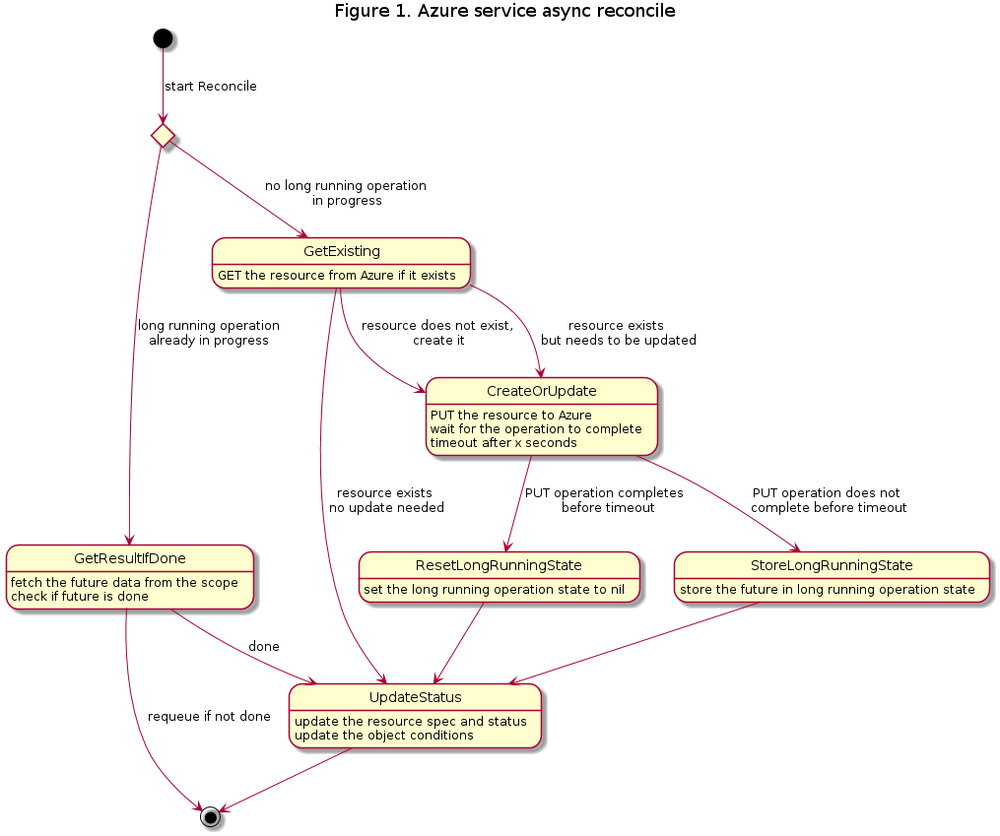
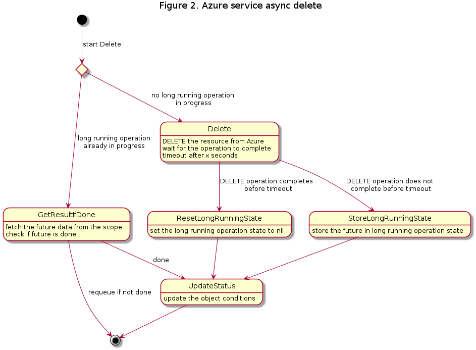
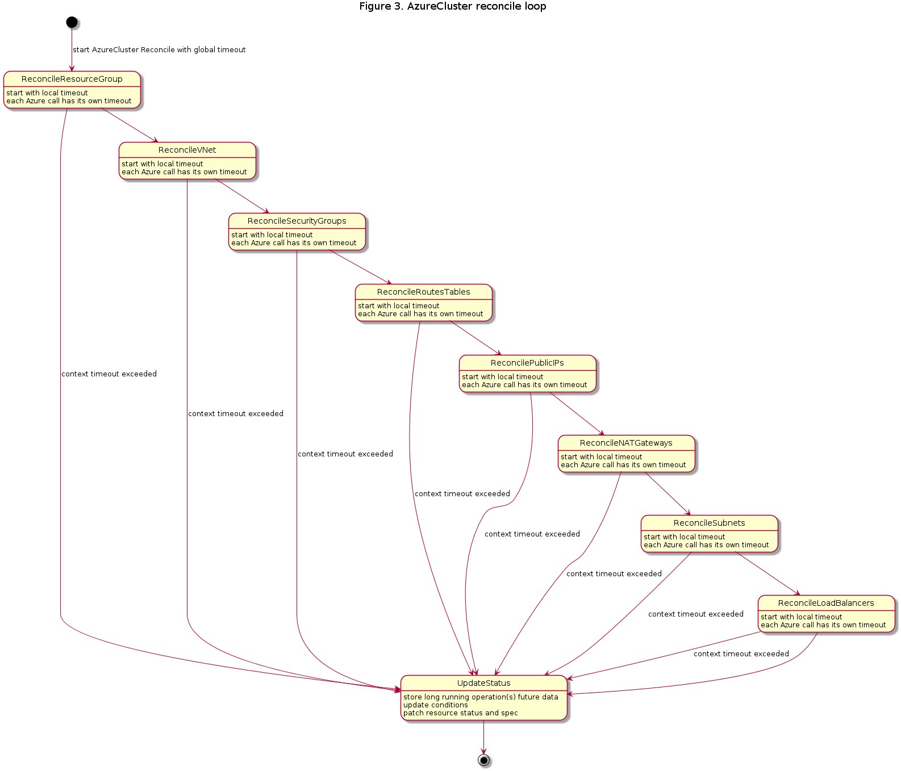

# Async Azure Resource Creation and Deletion

## <a name='TableofContents'></a>Table of Contents

<!-- vscode-markdown-toc -->
* [Table of Contents](#TableofContents)
* [Summary](#Summary)
* [Motivation](#Motivation)
	* [Goals](#Goals)
	* [Non-Goals / Future Work](#Non-GoalsFutureWork)
* [Proposal](#Proposal)
	* [User Stories](#UserStories)
		* [Story 1 - UX of creating an AzureCluster](#Story1-UXofcreatinganAzureCluster)
		* [Story 2 - Scaling up a MachineDeployment](#Story2-ScalingupaMachineDeployment)
		* [Story 3 - Deleting an individual Azure Machine Pool Machine](#Story3-DeletinganindividualAzureMachinePoolMachine)
	* [Implementation Details/Notes/Constraints](#ImplementationDetailsNotesConstraints)
	* [Proposed API Changes](#ProposedAPIChanges)
	* [Proposed Controller Changes](#ProposedControllerChanges)
		* [Context timeouts](#Contexttimeouts)
		* [Service Reconcile](#ServiceReconcile)
		* [Service Delete](#ServiceDelete)
		* [AzureCluster Reconcile](#AzureClusterReconcile)
	* [Proposed New Conditions](#ProposedNewConditions)
	* [Open Questions](#OpenQuestions)
		* [1. What should the timeout durations be?](#Whatshouldthetimeoutdurationsbe)
* [Alternatives](#Alternatives)
	* [Parallel reconciliation of Azure services](#ParallelreconciliationofAzureservices)
		* [Pros](#Pros)
		* [Cons](#Cons)
		* [Conclusion](#Conclusion)
* [Additional Details](#AdditionalDetails)
	* [Test Plan](#TestPlan)
* [Implementation History](#ImplementationHistory)

<!-- vscode-markdown-toc-config
	numbering=false
	autoSave=false
	/vscode-markdown-toc-config -->
<!-- /vscode-markdown-toc -->

## <a name='Summary'></a>Summary

CAPZ reconcilers currently call Azure and wait for each operation before proceeding. We should create/update/delete Azure resources asynchronously, especially for operations that take a long time to complete, such as Virtual Machine creation and deletion.

## <a name='Motivation'></a>Motivation

Blocking on success is sometimes the right thing to do but most of the time, it's the equivalent of the UI freezing on an app because you have used the UI thread to fetch some data causing your user to wonder why and when the software will react. This proposal aims to make the reaction time of the CAPZ controller drastically faster and possibly, more resilient.

### <a name='Goals'></a>Goals

- Accelerate the feedback loop with the user so they can know that reconciliation is progressing without having to go check the Azure resources in the portal/CLI/etc.
- Make the time for the controller to react to a change much faster
- Improve the resiliency of the controller by making it more fault tolerant
- Make it easier for the user to understand the state of each resource by adding more granular Conditions
- Apply the same asynchronous pattern to all resources

### <a name='Non-GoalsFutureWork'></a>Non-Goals / Future Work

- Increase or decrease overall duration of reconciliation
- Increase the number of API calls to Azure
- Start Azure operations for an AzureCluster, AzureMachine, or AzureMachinePool in parallel
- Predict how long each operation will take

## <a name='Proposal'></a>Proposal

### <a name='UserStories'></a>User Stories

#### <a name='Story1-UXofcreatinganAzureCluster'></a>Story 1 - UX of creating an AzureCluster

Blake is a Program Manager trying out Cluster API for the first time. Blake is following the quickstart documentation in the Cluster API book and using Azure to create a cluster. Blake applies the cluster template on the management cluster and describes the resulting AzureCluster resource. The AzureCluster is in "Creating" state and the Conditions get updated as Azure resources are created to show the progress.

#### <a name='Story2-ScalingupaMachineDeployment'></a>Story 2 - Creating AzureMachines concurrently

Alex is an engineer in a large organization which has a MachineDeployment running. Alex needs to scale up the number of replicas of the MachineDeployment by 200. Alex uses `kubectl` to scale the number of replicas in the MachineDeployment by 200. The AzureMachine controller in the management cluster is running with the default concurrency of 10. Ten new AzureMachines are created and their state quickly becomes "Creating". Shortly after, before the first ten machines are done creating, ten new ones start creating. The same thing happens until all 200 AzureMachines are in "Creating" state. Alex checks the Conditions on one of the creating AzureMachines and sees that the network interface was created successfully, and that the VM is being created. This allows Alex to quickly scale up the number of replicas as the new 200 VMs get created concurrently, without having to increase the controller concurrency.

#### <a name='Story3-DeletinganindividualAzureMachinePoolMachine'></a>Story 3 - Deleting an individual Azure Machine Pool Machine

Kai is an engineer in a large organization which has a MachinePool running. Kai needs to delete the Machine Pool. Kai uses `kubectl` to delete the Machine Pool. After a few seconds, Kai checks the Conditions on the MachinePool and sees that the VM is being deleted.

### <a name='ImplementationDetailsNotesConstraints'></a>Implementation Details/Notes/Constraints

There is an existing implementation of asynchronous reconciliation for AzureMachinePools. The   `AzureMachinePoolStatus` stores a single `LongRunningOperationState` used to keep the Future returned by VMSS long running operations.

```go
// Future contains the data needed for an Azure long-running operation to continue across reconcile loops.
type Future struct {
    // Type describes the type of future, update, create, delete, etc
    Type string `json:"type"`
    // ResourceGroup is the Azure resource group for the resource
    // +optional
    ResourceGroup string `json:"resourceGroup,omitempty"`
    // Name is the name of the Azure resource
    // +optional
    Name string `json:"name,omitempty"`
    // FutureData is the base64 url encoded json Azure AutoRest Future
    FutureData string `json:"futureData,omitempty"`
}

// AzureMachinePoolStatus defines the observed state of AzureMachinePool
AzureMachinePoolStatus struct {
    /*
      Other fields omitted for brevity    
    */
    
    // LongRunningOperationState saves the state for an Azure long-running operations so it can be continued on the
    // next reconciliation loop.
    // +optional
    LongRunningOperationState *infrav1.Future `json:"longRunningOperationState,omitempty"`
}
```

### <a name='ProposedAPIChanges'></a>Proposed API Changes

The proposed changes below show the changes to AzureCluster, AzureMachine, AzureMachinePool, and AzureMachinePoolMachine. The existing `LongRunningOperationState` field in AzureMachinePoolStatus will be pluralized to `LongRunningOperationStates` to store a list of Futures, following a similar pattern than Conditions, and will be extended to other CAPZ CRDs. In addition, the `Name` field of the `Future` type will be made required, as it becomes the identifier for a Future.

```go
// Future contains the data needed for an Azure long-running operation to continue across reconcile loops.
type Future struct {
    // Type describes the type of future, such as update, create, delete, etc
    Type string `json:"type"`
    // ResourceGroup is the Azure resource group for the resource.
    // +optional
    ResourceGroup string `json:"resourceGroup,omitempty"`
    // ServiceName is the name of the Azure service the resource belongs to.
    ServiceName string `json:"serviceName"`
    // Name is the name of the Azure resource.
    Name string `json:"name"`
    // Data is the base64 url encoded json Azure AutoRest Future.
    Data string `json:"data,omitempty"`
}

type Futures []Future

// AzureClusterStatus defines the observed state of AzureCluster.
type AzureClusterStatus struct {
    /*
      Other fields omitted for brevity    
    */

    // LongRunningOperationStates saves the states for Azure long-running operations so they can be continued on the
    // next reconciliation loop.
    // +optional
    LongRunningOperationStates Futures `json:"longRunningOperationStates,omitempty"`
}

// AzureMachineStatus defines the observed state of AzureMachine.
type AzureMachineStatus struct {
    /*
      Other fields omitted for brevity    
    */

    // LongRunningOperationStates saves the states for Azure long-running operations so they can be continued on the
    // next reconciliation loop.
    // +optional
    LongRunningOperationStates Futures `json:"longRunningOperationStates,omitempty"`
}

// AzureMachinePoolStatus defines the observed state of AzureMachinePool.
type AzureMachinePoolStatus struct {
    /*
      Other fields omitted for brevity    
    */

    // LongRunningOperationStates saves the states for Azure long-running operations so they can be continued on the
    // next reconciliation loop.
    // +optional
    LongRunningOperationStates Futures `json:"longRunningOperationStates,omitempty"`
}

// AzureMachinePoolMachineStatus defines the observed state of AzureMachinePoolMachine.
type AzureMachinePoolMachineStatus struct {
    /*
      Other fields omitted for brevity
    */

    // LongRunningOperationStates saves the states for Azure long-running operations so they can be continued on the
    // next reconciliation loop.
    // +optional
    LongRunningOperationStates Futures `json:"longRunningOperationStates,omitempty"`
}

```

### <a name='ProposedControllerChanges'></a>Proposed Controller Changes

#### <a name='Contexttimeouts'></a>Context timeouts

* Reduce the global controller reconcile loop context timeout to 15 seconds (currently 90 minutes).
* For each Azure service reconcile, add a local context timeout of 5 seconds.
* Add an `AzureClientTimeout` which is the duration after which an Azure operation is considered a long running operation which should be handled asynchronously. Proposed starting value is 2 seconds.
* For each Azure API call which returns a Future, wait for the operation to be completed for the above timeout duration. If the operation is not completed within the timeout duration, set Future of that resource in `LongRunningOperationStates` with the marshalled future data.

For each Azure service, this is what the new asynchronous reconcile and delete flows will look like:

#### <a name='ServiceReconcile'></a>Service Reconcile



#### <a name='ServiceDelete'></a>Service Delete



And below is a diagram to illustrate what an end-to-end flow of the proposed AzureCluster Reconcile would look like.

#### <a name='AzureClusterReconcile'></a>AzureCluster Reconcile



* Note 1: this represents an example AzureCluster reconcile loop. Some additional services may be called for some AzureClusters. Similar concepts apply to the other controllers (e.g. AzureCluster Delete, AzureMachine Reconcile, etc.)
* Note 2: Resource Group and VNet can only have 1 resource of each type. The other services may have one or more resources to create. For services which have multiple resources to create, the controller will be able kick off multiple asynchronous operations to create or delete the resources of the same type, assuming they all get started within the local and global context timeout. This is based on the assumption that no two resources of the same type should have any dependency on each other. For example, if there are 3 load balancers to be deleted, all 3 delete operations will be started in the the same reconcile loop, even if one or more of the calls doesn't complete within the `AzureClientTimeout`.

### <a name='ProposedNewConditions'></a>Proposed New Conditions

* Set conditions at the end of each controller loop that describe the current state of the object and its associated Azure resources.

The existing conditions before this proposal can be seen [here](https://github.com/kubernetes-sigs/cluster-api-provider-azure/blob/v0.5.0/api/v1alpha4/conditions_consts.go). Note that these existing conditions will be left unchanged, and are purposefully left out below.

Part of the proposed changes is to add new conditions for Azure CRDs. More granular conditions, paired with more responsive controllers, will allow for better visibility into the state of each resource. Initially, the following conditions will be added:

```go
// Azure Services Conditions and Reasons.
const (
    // ResourceGroupReadyCondition means the resource group exists and is ready to be used.
    ResourceGroupReadyCondition clusterv1.ConditionType = "ResourceGroupReady"
    // VNetReadyCondition means the virtual network exists and is ready to be used.
    VNetReadyCondition clusterv1.ConditionType = "VNetReady"
    // SecurityGroupsReadyCondition means the security groups exist and are ready to be used.
    SecurityGroupsReadyCondition clusterv1.ConditionType = "SecurityGroupsReady"
    // RouteTablesReadyCondition means the route tables exist and are ready to be used.
    RouteTablesReadyCondition clusterv1.ConditionType = "RouteTablesReady"
    // PublicIPsReadyCondition means the public IPs exist and are ready to be used.
    PublicIPsReadyCondition clusterv1.ConditionType = "PublicIPsReady"
    // NATGatewaysReadyCondition means the NAT gateways exist and are ready to be used.
    NATGatewaysReadyCondition clusterv1.ConditionType = "NATGatewaysReady"
    // SubnetsReadyCondition means the subnets exist and are ready to be used.
    SubnetsReadyCondition clusterv1.ConditionType = "SubnetsReady"
    // LoadBalancersReadyCondition means the load balancers exist and are ready to be used.
    LoadBalancersReadyCondition clusterv1.ConditionType = "LoadBalancersReady"
    // PrivateDNSReadyCondition means the private DNS exists and is ready to be used.
    PrivateDNSReadyCondition clusterv1.ConditionType = "PrivateDNSReady"
    // BastionHostReadyCondition means the bastion host exists and is ready to be used.
    BastionHostReadyCondition clusterv1.ConditionType = "BastionHostReady"
    // InboundNATRulesReadyCondition means the inbound NAT rules exist and are ready to be used.
    InboundNATRulesReadyCondition clusterv1.ConditionType = "InboundNATRulesReady"
    // AvailabilitySetReadyCondition means the availability set exists and is ready to be used.
    AvailabilitySetReadyCondition clusterv1.ConditionType = "AvailabilitySetReady"
    // RoleAssignmentReadyCondition means the role assignment exists and is ready to be used.
    RoleAssignmentReadyCondition clusterv1.ConditionType = "RoleAssignmentReady"

    // CreatingReason means the resource is being created.
    CreatingReason = "Creating"
    // FailedReason means the resource failed to be created.
    FailedReason = "Failed"
    // DeletingReason means the resource is being deleted.
    DeletingReason = "Deleting"
    // DeletedReason means the resource was deleted.
    DeletedReason = "Deleted"
    // DeletionFailedReason means the resource failed to be deleted.
    DeletionFailedReason = "DeletionFailed"
)
```

### <a name='OpenQuestions'></a>Open Questions

#### <a name='Whatshouldthetimeoutdurationsbe'></a>1. What should the timeout durations be?

The specific numbers are not set in stone, and should be revised after doing some performance testing with different values and calculating the P99 expected completion time of operations that are not long-running.

The other question is whether we should have the same timeout value for all operations (the 5s) or curate per operation. For simplicity, the proposal is to start with a single value. Later on, we might want to optimize by calculating a dynamic timeout value for each operation based on heuristics. That would be better than statically defining artificial timeout durations for each operation which might vary over time and might not be the same depending on region, subscription, etc.

#### 2. How to handle transient errors in logs?

The idea of short-circuiting the Reconcile loop when a long-running operation is in progress involves returning an error when an operation is not done. This means that the Reconcile loop will end in an error every time an operation is in progress. This is necessary because we need to requeue so that the reconcile loop can run again to check on the progress of the operation, but it also means that the user might will see the error message in the logs. How can we handle transient errors in logs without spamming the logs and therefore causing noise that reduces the user's ability to see actual errors in reconcile?

## <a name='Alternatives'></a>Alternatives

### <a name='ParallelreconciliationofAzureservices'></a>Parallel reconciliation of Azure services

The idea would be to start multiple Azure operations in parallel. This could be done either by defining a dependency graph or by starting all operations in parallel and retrying the ones that fail until they all succeed.

#### <a name='Pros'></a>Pros

- Reduces the overall time it takes to do a full reconcile

#### <a name='Cons'></a>Cons

- Most of the resources have dependencies on one another which means they have to be created and deleted serially, so the actual gain we get from parallelizing is minimal.
- Added complexity and maintenance of the dependency graph.
- If not using a dependency graph, sending bad requests to Azure would increase the number of API calls and possibly cause a busy signal from the Azure APIs.

#### <a name='Conclusion'></a>Conclusion

This is not mutually exclusive with the proposal above. In fact, it might be a good idea to do both in the long run. However, the gains from parallelizing the operations are minimal compared to what we can get by not blocking on long running operations so we should proceed by first making the resource creation and deletion async, then evaluate to see if we need further performance improvements.

## <a name='AdditionalDetails'></a>Additional Details

### <a name='TestPlan'></a>Test Plan

* Unit tests to validate the proper handling of Futures in the various CRD Status fields.
* existing e2e tests for create, upgrade, scale down / up, and delete

## <a name='ImplementationHistory'></a>Implementation History

- 2020/12/04: Initial POC [PR](https://github.com/kubernetes-sigs/cluster-api-provider-azure/pull/1067) for AzureMachinePool opened
- 2021/07/16: Initial proposal
