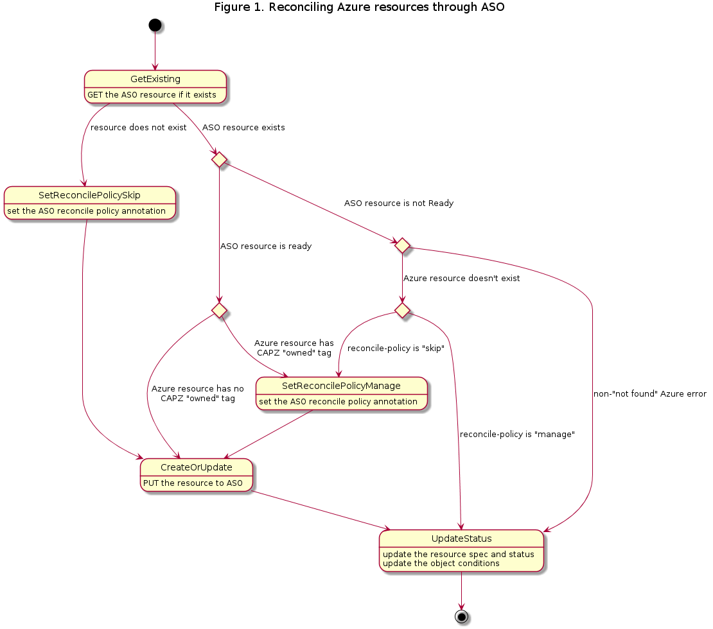
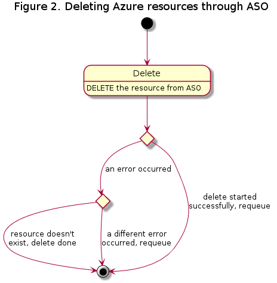

# Managing Azure Resources with Azure Service Operator

## Table of Contents

- [Managing Azure Resources with Azure Service Operator](#managing-azure-resources-with-azure-service-operator)
  - [Table of Contents](#table-of-contents)
  - [Glossary](#glossary)
  - [Summary](#summary)
  - [Motivation](#motivation)
    - [Goals](#goals)
    - [Non-Goals/Future Work](#non-goalsfuture-work)
  - [Proposal](#proposal)
    - [User Stories](#user-stories)
      - [Story 1 - Users of new Azure features](#story-1---users-of-new-azure-features)
      - [Story 2 - Developer experience](#story-2---developer-experience)
    - [Implementation Details/Notes/Constraints](#implementation-detailsnotesconstraints)
        - [Reconciliation](#reconciliation)
        - [API Changes](#api-changes)
        - [Installation](#installation)
        - [Caveats](#caveats)
    - [Security Model](#security-model)
    - [Risks and Mitigations](#risks-and-mitigations)
  - [Alternatives](#alternatives)
      - [Adopt new SDK directly](#adopt-new-sdk-directly)
      - [Crossplane](#crossplane)
  - [Upgrade Strategy](#upgrade-strategy)
  - [Additional Details](#additional-details)
    - [Test Plan](#test-plan)
    - [Graduation Criteria](#graduation-criteria)
  - [Implementation History](#implementation-history)

## Glossary

- **Azure Service Operator (ASO)** - ([link](https://azure.github.io/azure-service-operator/)) a collection of Kubernetes CRDs and controllers which extend the Kubernetes API to manage Azure resources like virtual machines and resource groups.
- **Bring-your-own (BYO) resource** - an Azure resource participating in a Cluster API cluster but managed by the user. CAPI and CAPZ should not modify or delete this resource.

## Summary

This proposal describes how CAPZ could utilize Azure Service Operator (ASO) to create, read, update, and delete Azure resources via the Kubernetes API using custom resources defined and reconciled by ASO.

## Motivation

As a Cluster API infrastructure provider, CAPZ's functionality can be broadly divided into:
1. Translating Cluster API resource definitions into Azure infrastructure definitions
2. Interfacing with the Azure platform to manage creating, updating, and deleting that infrastructure

Currently, CAPZ handles `2.` with Azure API calls, which requires ensuring dependencies between Azure resources are met and maintaining state to asynchronously handle long-running operations. Because ASO's primary objective is to handle `2.`, CAPZ's controller implementations could then interact with the Kubernetes API declaratively to manage Azure resources through ASO objects and let ASO handle the finer details of ensuring that desired state is achieved in Azure. By then primarily focusing on `1.`, CAPZ reduces its overall code maintenance burden and affirms ASO as the canonical way to manage Azure infrastructure from Kubernetes.

In addition, the [Azure Go SDK](https://github.com/Azure/azure-sdk-for-go) has recently deprecated its set of APIs that CAPZ currently uses in favor of a new set of backwards-incompatible APIs. Because the deprecated Azure Go SDK APIs are no longer receiving updates to adopt new Azure API versions, CAPZ must adopt the new APIs to be able to expose the newest features in Azure to its users. Because ASO already uses the new APIs, adopting ASO in CAPZ accomplishes the goal of migrating off of the deprecated APIs.

### Goals

- Logically separate transformation of Cluster API resources to infrastructure definitions from reconciliation of that infrastructure in Azure
- Determine a method to migrate CAPZ's Azure service interfaces iteratively to use ASO without requiring any single major change affecting every interface
- Determine how ASO will be installed on Cluster API management clusters

### Non-Goals/Future Work

- Entirely eliminate direct usage of any Azure Go SDK
- Reconcile long-running Azure operations asynchronously by waiting for
  Kubernetes watch events from changes to the `status` of ASO resources instead
  of periodically checking if the operation is complete
- Reconcile different Azure resource types for the same workload cluster in parallel
- Allow users to interact with CAPZ-created ASO resources directly, out-of-band with CAPZ
- Adopt Azure Workload Identity to authenticate with Azure APIs
- Deprecate the `status.longRunningOperationStates` field on CAPZ resources

## Proposal

### User Stories

#### Story 1 - Users of new Azure features

As a CAPZ user I want to take advantage of the latest and greatest features in Azure only available in the newest Azure API versions in my clusters managed by CAPZ. This would allow me to adopt CAPZ for a wider range of use cases and continue evolving my CAPZ clusters alongside the Azure API.

#### Story 2 - Developer experience

As a CAPZ developer I would like to only need to interact with the Kubernetes API server using Custom Resource Definitions representing Azure resources rather than having to deal with the impedance of interacting with the Azure APIs. This would enable me to focus more on the core value of CAPZ, transforming Cluster API resource definitions to Azure resource definitions.

### Implementation Details/Notes/Constraints

#### Reconciliation

To minimize impact initially, much of the existing pattern in `/azure/services` for interfacing with Azure services will be reused. The biggest change will involve a new wrapper adjacent to `/azure/services/async` such as `/azure/services/aso` which will handle functionality common to all ASO resources. The following diagram is based on the [async reconciliation diagram](./images/async-reconcile.png) and shows how resources will be reconciled with ASO:



Similarly for the [async delete diagram](./images/async-delete.png), the following diagram shows how resources will be deleted with ASO:



A proof-of-concept of the reconciliation flow has been implemented for Azure resource groups and is available here: https://github.com/nojnhuh/cluster-api-provider-azure/tree/aso/azure/services/asogroups

##### BYO Resources

BYO resources likely will not exist as ASO resources, so determining whether or not a given expected Azure resource exists becomes less straightforward using ASO. Initially, both BYO and CAPZ-managed resources will be created in ASO with ASO's `serviceoperator.azure.com/reconcile-policy: skip` label which tells ASO not to make any changes to the corresponding Azure resource, essentially assuming the resource is BYO. ASO will then perform a GET request against the Azure API to fill in the resource's `status`, which may indicate the resource does not exist with a status condition with a `reason: AzureResourceNotFound`. Then, if a future CAPZ reconciliation reveals the Azure resource does not exist, CAPZ will change its assumption and make ASO "adopt" the resource by setting `serviceoperator.azure.com/reconcile-policy: manage` to allow changes made to the ASO resource to be reflected in Azure.

#### API Changes

Integration with ASO will not require any updates to CAPZ resources and CAPZ's CRDs will not require any updates. The only potentially user-affecting change is that the `status.longRunningOperationStates` on CAPZ resources will no longer be populated. This field is currently set for CAPZ's internal use to inform the `status.conditions` of the resource. With ASO, a CAPZ resource's `status.conditions` will now be derived from ASO resources' `status.conditions`.

#### Installation

ASO is a self-contained component published independently of CAPZ. When CAPZ is relying on ASO for critical functionality, CAPZ's installation process should also automatically install ASO.

When installing CAPZ with `clusterctl init`, the Kubernetes resources defined by CAPZ's `infrastructure-components.yaml` published on the corresponding release are installed. ASO can also be [installed with a YAML manifest](https://azure.github.io/azure-service-operator/introduction/installing-from-yaml/) published for each of its releases describing its components that can be incorporated with CAPZ's `infrastructure-components.yaml`. This method installs ASO in the `azureserviceoperator-system` namespace and expects a Secret named `aso-controller-settings` to exist with Service Principal credentials. The easiest and most flexible way to customize that manifest further would likely be to generate a manifest from ASO's Helm chart with any necessary values overridden.

Other than integrating with CAPZ's `infrastructure-components.yaml`, the `capz-controller-manager` container itself could assume responsibility for installing ASO by using the Helm Go library to install the ASO chart when it starts. Installing ASO this way allows CAPZ to hook in additional logic, such as to check if ASO is already installed in the cluster or to verify ASO is healthy after it's installed, which would not be possible if a static manifest was embedded in `infrastructure-components.yaml`. However, installing ASO components from CAPZ itself would also require CAPZ to have additional RBAC permissions to create, update, and delete ASO's Deployment, Service, and other components which would not be required if the components were managed from `infrastructure-components.yaml`.

For either method of installing the rest of ASO, ASO's CRDs will be installed from `infrastructure-components.yaml` to more easily facilitate `clusterctl move` and to keep the `capz-controller-manager` Pod from requiring RBAC permissions to create, update, and delete CRDs.

In terms of specific options, ASO offers both [single- and multi-operator configurations](https://azure.github.io/azure-service-operator/introduction/multitenant-deployment/). The single-operator option is the default, and assumes a single ASO installation managing resources for the whole cluster. The multi-operator method allows several ASO installations to coexist, each monitoring resources in a unique set of namespaces to enable multitenancy. ASO's single-operator configuration also allows multitenancy with more tightly-scoped credentials. Overall, a single ASO installation will likely be the easier path forward since it's consistent with CAPZ's multitenancy model and doesn't involve managing ASO's CRDs and webhooks across multiple installations.

The recommendation in this proposal is to install a single-operator, ["reduced permissions"](https://azure.github.io/azure-service-operator/design/adr-2023-02-helm-chart-size-limitations/#decision) configuration of ASO entirely from `infrastructure-components.yaml` to keep CAPZ from needing any new RBAC permissions to install ASO and to align with how CAPZ handles its existing dependency on AAD Pod Identity.

#### `clusterctl move`

`clusterctl move` is expected to work automatically following ASO's [documented best practices](https://azure.github.io/azure-service-operator/introduction/frequently-asked-questions/#what-is-the-best-practice-for-transferring-aso-resources-from-one-cluster-to-another) to move its resources pending a solution to this issue in Cluster API: https://github.com/kubernetes-sigs/cluster-api/issues/8473

### Security Model

ASO requires credentials to interact with Azure which are documented here: https://azure.github.io/azure-service-operator/introduction/authentication/. Specifically, ASO needs the values of `$AZURE_CLIENT_ID`, `$AZURE_CLIENT_SECRET` or `$AZURE_CLIENT_CERTIFICATE`, `$AZURE_SUBSCRIPTION_ID`, and `$AZURE_TENANT_ID` for Service Principal authentication. These credentials must be defined in a Kubernetes Secret that either applies to all ASO resources in all namespaces, all ASO resources in a particular namespace, or individual ASO resources referring to the Secret in its `serviceoperator.azure.com/credential-from` annotation. ASO allows different credentials to be used for different resources to enable multitenancy, similar to CAPZ and its AzureClusterIdentity. To mediate between the two mechanisms, CAPZ will ensure a cluster's AzureClusterIdentity or default parameters from environment variables are reflected in a Secret to be used by ASO and ensure each ASO resource it manages is created with the annotation pointing to the Secret.

Consumers of ASO's APIs (such as CAPZ) also need Kubernetes RBAC permissions to interact with ASO resources. For example, this ClusterRole snippet is required by CAPZ to manage resource groups with ASO:
```yaml
- apiGroups:
  - resources.azure.com
  resources:
  - resourcegroups
  - resourcegroups/status
  verbs:
  - get
  - list
  - watch
  - create
  - update
  - delete
```
The above permissions may overlap with ASO resources already installed by a user not intended to be managed by CAPZ.

### Risks and Mitigations

The most immediate risks with adopting ASO are regressions of various forms. Firstly, Azure API calls are core to CAPZ's functionality, so even small behavioral differences may cause issues preventing Azure resources from being reconciled as expected. Next, the modified reconciliation flow may cause operations against workload clusters to take longer to complete, in particular if it takes more reconciliations to perform a task. Finally, integration with ASO may introduce new or worsen existing bottlenecks limiting how many CAPZ resources can be managed. Scaling bottlenecks might be Azure API rate limits or management cluster Kubernetes API server load because of the increased number of CRDs and custom Kubernetes resources required to represent each individual Azure resource making up Cluster API clusters. These risks will be monitored closely as described in the [Test Plan](#test-plan). Any significant regressions found can be rolled back backwards-compatibly by reverting the relevant changes.

Along those same lines, there is a risk that if a service is implemented both with the SDK and with ASO in different supported versions of CAPZ, then the fix for an issue affecting both versions will need to be implemented separately for each version. Such issues are not expected to be common given the implementation for each ASO service is expected to be mostly disjoint from its SDK-based implementation. When they do arise, however, the cost of the extra work required for a second implementation of a fix will be accepted since the risk will only be present for a few months at most as newer CAPZ releases push SDK-backed service implementations out of support.

Another shorter-term risk is that although ASO v2 is [officially supported by Microsoft](https://azure.github.io/azure-service-operator/introduction/frequently-asked-questions/#what-is-the-support-model), it has not yet published a GA release. The remaining work to be completed before ASO v2's first GA release is being tracked here: https://github.com/Azure/azure-service-operator/milestone/20.

Similarly, ASO does not currently support some Azure services used by CAPZ currently which are being tracked here: https://github.com/Azure/azure-service-operator/issues/2237. If a service is not yet implemented in ASO by the time CAPZ is ready for it, a track 2 SDK-backed implementation can be added instead. Additionally, some Azure services like Resource Health do not represent infrastructure and therefore don't closely align with ASO's model for creating, updating, and deleting resources. If those kinds of services are determined not to ever be a good fit for ASO, then SDK-backed implementations for those interfaces could be added as well.

Further down the road, there is an apparent increased risk that CAPZ's lifespan may extend beyond that of its Azure interface when ASO is used instead of the API or SDK directly, as ASO has not yet been proven as a mission-critical interface to Azure to the same extent as Azure's REST API and Go SDK.

Since ASO can be freely installed by users, there is also a risk that a CAPZ-installed ASO may conflict with a user-installed instance. Before CAPZ installs ASO, it should verify that ASO is already either not installed or installed and configured as expected by CAPZ.

The difference between CAPZ's and ASO's metrics stories may also be considered a risk. CAPZ's metrics currently include traces that measure how long each step in a reconciliation takes, including all Azure API calls. Once those equivalent API calls are being done from ASO instead of CAPZ, CAPZ's metrics will lose that data. However, that lost data may no longer be meaningful to CAPZ since Azure API calls will be happening out-of-band with CAPZ reconciliations. ASO does measure how many Azure API calls are made and how long each takes and exposes those in the Prometheus format, along with other metrics as documented at https://azure.github.io/azure-service-operator/introduction/metrics/. However, users relying on the current structure of metrics will likely experience breaking changes.

Dependency on ASO may also negatively impact the time between new features being available in Azure and CAPZ being able to take advantage of them. Although ASO can publish updated CRDs with new Azure API versions independently from the SDK, a few factors contribute to the likelihood of ASO lagging a bit behind the SDK:
- The Azure SDK's code generation pipeline is currently more mature than ASO's.
- The SDK ships one package at a time whereas ASO ships all resources together, which could result in scenarios where some resources may have updated API versions but are waiting on other unrelated resources to be updated so ASO can batch several updates into a single release.
- ASO provides some features not included in the SDK, like populating ConfigMaps and Secrets with credentials and other outputs from provisioning, and implementing those features is not automatic.
- Resource types generated for the SDK occasionally cannot be represented as Kubernetes types for ASO, like resources that are potentially infinitely recursive.

This risk that newer features may not be available as quickly is mitigated by the historical precedent that CAPZ has not often been blocked on adding new features because no SDK includes the newest API versions yet. CAPZ's current cadence of adding new features to releases every two months also provides a buffer which means even if the SDK makes a new feature available before ASO, CAPZ's next feature release may not be scheduled until after the feature is available from both and implemented in CAPZ.

## Alternatives

### Adopt new SDK directly

To shed its dependency on the deprecated Azure Go SDK, CAPZ could adopt the new Azure Go SDK and use it directly instead of transitively through ASO. The newer SDK's concepts like how Azure resources are defined and operated against map much more directly to those of the older SDK, so a transition to using the newer SDK directly is likely much more mechanical than a similar move to ASO. A simpler transition would not be as prone to many of the risks listed above, particularly the risk of introducing regressions. It would also likely take less time to complete, mitigating any risks and reducing maintenance costs associated with using both the old and new patterns at the same time in different service implementations.

The new Go SDK also separates each Azure service (containerservice, network, etc.) into distinct Go modules, where each module version maps to a single Azure API version. Modules for stable APIs use semantic versions like "v1.0.0" while for preview APIs they have pre-release versions like "v1.0.0-beta.1" with the same major version as the stable API. This would make it difficult to use different API versions side-by-side, like a preview and stable version for https://github.com/kubernetes-sigs/cluster-api-provider-azure/issues/2625, since the Go toolchain likely will never natively support importing two different minor/patch versions of the same module: https://github.com/golang/go/issues/31578. ASO instead exposes multiple Azure API versions in each of its releases with different Kubernetes API versions of its types, so CAPZ can use a single version of ASO to gain access to several Azure API versions more easily than with the SDK directly.

CAPZ is currently also experimenting with this approach and that effort is being tracked in this issue: https://github.com/kubernetes-sigs/cluster-api-provider-azure/issues/2670

### Crossplane

Another alternative is [Crossplane](https://www.crossplane.io/), a CNCF project which is a set of Kubernetes controllers and Custom Resource Definitions like ASO that define and operate on resources for Azure and other cloud providers. A number of factors indicate that ASO may be a better fit for CAPZ:
- CRD definitions generated from the Azure Terraform provider maintained by
  HashiCorp, which may not keep up with changes as fast as the Azure API swagger
  specification from which ASO generates its definitions
- Still using the [deprecated Azure Go SDK](https://github.com/crossplane/crossplane/blob/08f11debb66cdf10ff0ddd14f1ee23aa9b4489b1/go.mod#L46-L55), no apparent plans to update
- [Open issue](https://github.com/upbound/provider-azure/issues/94) to support workload identity, which ASO already handles

## Upgrade Strategy

There are two main upgrade paths CAPZ needs to consider: the first between a version of CAPZ that does not use ASO to one that does, and the second between two versions of CAPZ that use different versions of ASO.

During the initial adoption of ASO, CAPZ's ASO-based [reconciliation flow](#reconciliation) will automatically adopt resources previously managed by CAPZ. This would be based on the `sigs.k8s.io_cluster-api-provider-azure_cluster_*` tag for Azure resources types that are known to possibly have the tag. CAPZ currently reconciles some Azure resources that either do not have the tag or cannot have tags at all, so some custom logic will be necessary to fill the gap. Affected resource types include the following:
- Agent pools
- Disks
- Inbound NAT rules
- Managed clusters
- Role assignments
- Subnets
- VM extensions
- Virtual network peerings

All of the resource types above are always assumed to be owned by CAPZ except for subnets, whose status is derived from its owning virtual network.

After that, a CAPZ upgrade may include a bump in the API version used for some ASO resource types. ASO will handle those changes transparently from CAPZ's perspective with its own conversion webhooks. The limit on the size of Kubernetes resources will likely force ASO to remove certain API versions of resources in CRDs in the future. When a version is deprecated in ASO, CAPZ will have to upgrade its use of the resource to a newer API version.

Separate from API version upgrades of resources, upgrades to ASO itself may be included in new versions of CAPZ. [ASO's documentation](https://azure.github.io/azure-service-operator/introduction/upgrading/) recommends upgrading using the same mechanism used to initially install. At the same time when CAPZ installs ASO, it will also upgrade an existing ASO it installed if necessary.

## Additional Details

### Test Plan

Adoption of ASO to manage Azure infrastructure is at the core of CAPZ's functionality. As such, changes made to integrate ASO must be thoroughly tested.

e2e tests will give the best indication if any regressions are introduced. Because no user-facing changes to CAPZ are expected as a result of integrating with ASO, all of the existing e2e tests will not need any changes to continue providing the same value they do already and do not need to compensate for the transition period where ASO is only partially integrated. New tests or additions to the test framework may include the following:
- a checkpoint when installing CAPZ in the framework that ASO is also installed and healthy
- upgrade tests from a version of CAPZ that does not use ASO to one that does,
  verifying that CAPZ-managed and unmanaged Azure resources become correctly
  reflected in ASO after the upgrade
- a test to verify when a CAPZ upgrade includes an upgrade of the ASO control plane
- a test to verify when a CAPZ upgrade includes a newer API version of an ASO resource

To catch performance and scalability regressions, one-off tests against CAPZ instances managing many and/or large workload clusters will also be performed. Telemetry will be inspected to ensure the time it takes to reconcile a high volume of clusters and the overhead required in the management cluster to run ASO are still acceptable.

Finally, unit tests will be added to cover tightly-scoped functional changes related to ASO adoption, like error handling.

### Graduation Criteria

ASO integration will not be kept behind a feature flag or matriculate through the usual alpha, beta, and stable phases. Instead, the transition will be made gradually so as to distribute potential impact over time.

Each Azure service package, such as `virtualmachines` or `loadbalancers` can be transitioned separately from using the SDK to ASO. The transition for a package will be made in one atomic change, so the SDK- and ASO-based implementations will never exist side-by-side for a given service. However, there will be a period of time where the SDK and ASO are driving mutually exclusive sets of services at the same time, and that time span may include several releases of CAPZ. If significant regressions are found in a particular service implementation, that service (and others that rely on it) can be rolled back in isolation to the SDK-based implementation independently of unaffected services.

Since the transition for each service is expected to take some time, it's worth considering which services to transition first. Because of how some ASO resource types reference each other, some ordering will be necessary. For example, a VirtualNetworksSubnet's `spec.owner` refers to the Kubernetes name of the owning ASO VirtualNetwork, so the `virtualnetworks` service would be implemented to use ASO before the same is done for `subnets`. When no ordering is otherwise necessary, the priority to implement each service will be based on new features which are blocked on newer Azure API versions available in ASO but not the SDK and also community involvement.

## Implementation History

- [ ] 01/23/2023: Document first created
- [ ] 02/21/2023: First complete draft of this document finished
