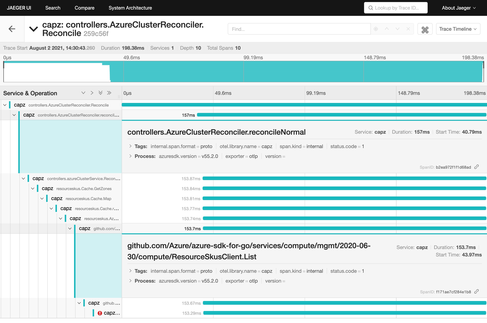
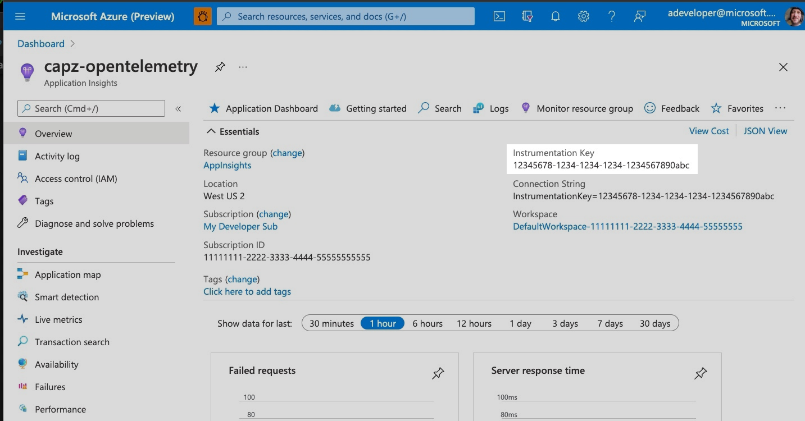
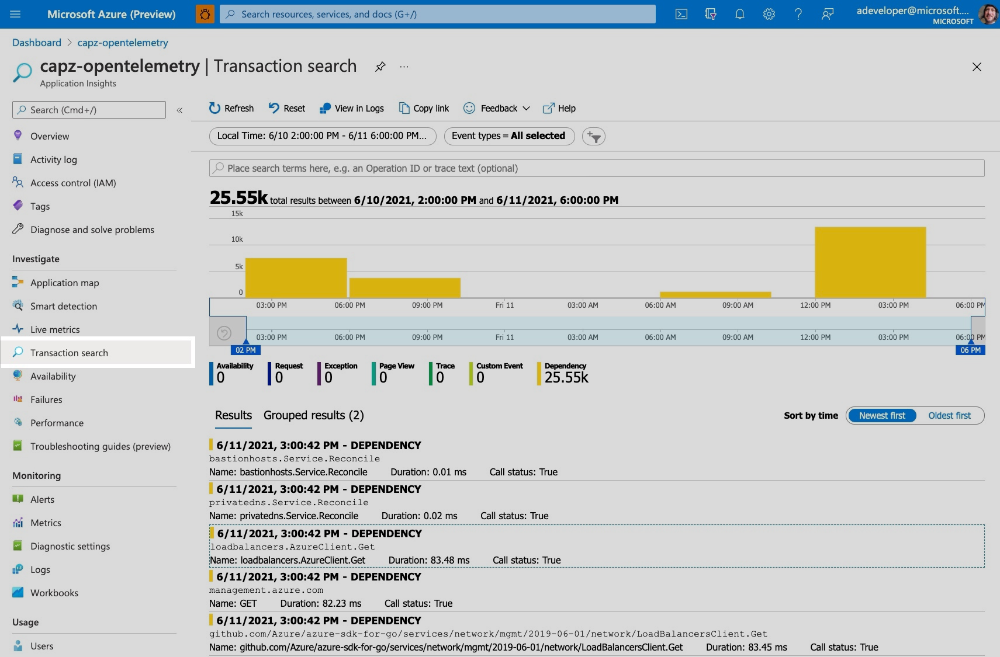
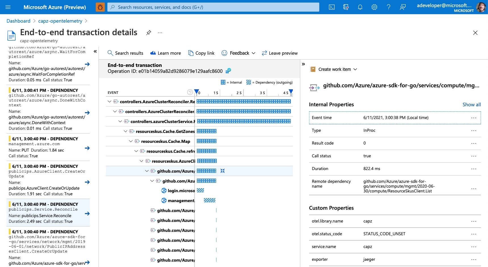

# OpenTelemetry Tracing

This directory contains resources to help deploy [opentelemetry-collector][1] and to export and view
[traces][2] locally in the Jaeger UI or in the cloud with Azure Application Insights.

When creating a management cluster for development with `make tilt-up`, OpenTelemetry tracing is
automatically enabled.

## View traces in Jaeger

`make tilt-up` installs a Jaeger "all-in-one" resource for viewing traces.

**NOTE:** The Jaeger "all-in-one" component uses in-memory storage and is designed for testing.

<!-- markdown-link-check-disable-next-line -->
Visit http://localhost:16686/ or select the "traces: jaeger-all-in-one" resource in the Tilt UI and
click on "View traces" near the top of the screen.



## View traces in Application Insights

Traces can be exported to the App Insights resource that you specify
with `AZURE_INSTRUMENTATION_KEY`.

If you don't have an App Insights resource, create one through the Azure Portal
at https://ms.portal.azure.com/#create/Microsoft.AppInsights.

To the upper right of the "Overview" page for your App Insights resource is an entry
for "Instrumentation Key".



Paste the Instrumentation Key from the portal as `AZURE_INSTRUMENTATION_KEY`
in `tilt-settings.json`:

```json
{
  "kustomize_substitutions": {
      "AZURE_INSTRUMENTATION_KEY": "12345678-1234-1234-1234-1234567890abc"
  }
}
```

Once your management cluster is up, search for recent traces on the "Transaction search" page.



Click on "See all data in the last 24 hours" and choose a "Dependency" entry to follow the traces
and timings of the CAPZ controller-controller-manager.



Traces may not show up immediately. Also, your management cluster needs to do work in order to
produce traces, so click on a cluster flavor in the Tilt web interface to create a workload cluster.

## Add OpenTelemetry to an existing cluster

**NOTE:** This tracing pipeline is evolving and should not be considered for production usage.

To add these OpenTelemetry components and configuration to an existing management cluster, first
install the Helm chart:

```shell
helm install opentelemetry-collector ./hack/observability/opentelemetry/chart \
  --namespace capz-system --values ./hack/observability/opentelemetry/values.yaml \
  --set config.exporters.azuremonitor.instrumentation_key=$AZURE_INSTRUMENTATION_KEY
```

Then enable tracing for the capz-controller-manager deployment:

- Edit the deployment in the capz-system namespace
- Under `spec.template.spec`, find the "manager" container
- Add this line to `args`:
    ```yaml
    --enable-tracing
    ```
- Save your changes

Once the updated deployment creates a new capz-controller-manager pod, it will send traces to the
"opentelemetry-collector" service on port 14268. The collector will then export the traces to the
App Insights resource.

## Contents

```
./hack/observability/opentelemetry/
├── controller-manager-patch.yaml
├── fetch-otel-resources.yaml
├── readme.md
├── values.yaml
└── chart
    ├── .helmignore
    ├── Chart.yaml
    ├── README.md
    ├── values.schema.json
    ├── values.yaml
    └── templates
        ├── _config.tpl
        ├── configmap-agent.yaml
        ├── deployment.yaml
        └── ... (and many others)
```

### CAPZ controller-manager patch

`controller-manager-patch.yaml` enables tracing on the CAPZ controller-manager pod. It is applied
automatically when doing development with `make tilt-up`.

### Helm chart values

`values.yaml` has configuration values for the opetelemetry-collector Helm chart. It is applied
automatically when doing development with `make tilt-up`.

### Helm chart

The `chart/` directory contains the [opentelemetry-collector][3] Helm chart. We store a copy locally
in order to use a known working version without needing to fetch it over the network.

Together, the chart and values create a tracing pipeline from the management cluster to
App Insights.

## Updating Resources

To update the local Helm chart to a [newer release][4], such as "0.6.1", run
`CHART_RELEASE=0.6.1 ./fetch-otel-resources.sh`. That script fetches the Helm chart and unpacks
it to the `chart` directory.


[1]: https://github.com/open-telemetry/opentelemetry-collector
[2]: https://github.com/open-telemetry/opentelemetry-specification/blob/main/specification/overview.md#tracing-signal
[3]: https://github.com/open-telemetry/opentelemetry-helm-charts
[4]: https://github.com/open-telemetry/opentelemetry-helm-charts/releases
