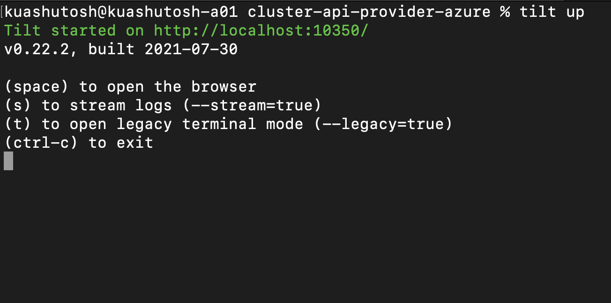
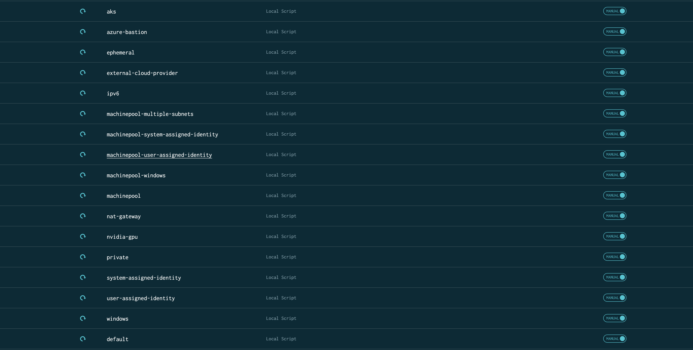

# Flavors

In `clusterctl` the infrastructure provider authors can provide different type of cluster templates,
or flavors; use the --flavor flag to specify which flavor to use; e.g

```shell
clusterctl generate cluster my-cluster --kubernetes-version v1.29.5 \
    --flavor private > my-cluster.yaml
```

See [`clusterctl` flavors docs](https://cluster-api.sigs.k8s.io/clusterctl/commands/generate-cluster.html#flavors).

This directory contains each of the flavors for CAPZ. Each directory besides `base` will be used to
create a flavor by running `kustomize build` on the directory. The name of the directory will be
appended to the end of the cluster-template.yaml, e.g cluster-template-{directory-name}.yaml. That
flavor can be used by specifying `--flavor {directory-name}`.

To generate all CAPZ flavors, run `make generate-flavors`.


## Running flavor clusters as a tilt resource

#### From Tilt Config
Tilt will auto-detect all available flavors from the `templates` directory.

#### Requirements
Please note your tilt-settings.yaml must contain at minimum the following fields when using tilt resources to deploy cluster flavors:
```yaml
kustomize_substitutions:
  AZURE_SUBSCRIPTION_ID: "******"
  AZURE_TENANT_ID: "******"
  AZURE_CLIENT_SECRET: "******"
  AZURE_CLIENT_ID: "******"
```
After updating tilt-settings.yaml, follow these two steps to deploy a workload cluster:

1. Run ``make tilt up`` in the root of cluster-api-provider-azure repo. Note that the tilt-settings.yaml also resides here in the
root of this repo. After tilt has initialized, press `space` to open the tilt web UI in a browser. See the following example:
   
2. Once your browser is open, click the clockwise arrow icon ⟳ on a resource listed. For example, `default` to deploy a default flavor.
   
#### Defining Variable Overrides
If you wish to override the default variables for flavor workers, you can specify them as part of your tilt-settings.yaml as seen in the example below.  Please note, the precedence of variables is as follows:

1. explicitly defined vars for each flavor i.e. worker-templates.flavors[0].AZURE_VNET_NAME
2. vars defined at 'metadata' level-- spans workers i.e. metadata.AZURE_VNET_NAME
3. programmatically defined default vars i.e. everything except azure tenant, client, subscription


```yaml
kustomize_substitutions:
  AZURE_SUBSCRIPTION_ID: "****"
  AZURE_TENANT_ID: "****"
  AZURE_CLIENT_SECRET: "****"
  AZURE_CLIENT_ID: "****"
worker-templates:
  flavors:
    default:
      CLUSTER_NAME: example-default-cluster-name
      AZURE_VNET_NAME: example-vnet-one
    system-assigned-identity:
      CLUSTER_NAME: example-SAI-cluster-name
      AZURE_LOCATION: westus
      AZURE_VNET_NAME: example-vnet-two
  metadata:
    AZURE_LOCATION: eastus
    AZURE_RESOURCE_GROUP: test-resource-group-name
    CONTROL_PLANE_MACHINE_COUNT: "1"
    KUBERNETES_VERSION: v1.22.1
    AZURE_CONTROL_PLANE_MACHINE_TYPE: Standard_B2s
    WORKER_MACHINE_COUNT: "2"
    AZURE_NODE_MACHINE_TYPE: Standard_B2s
```

Here is a practical example: creating a GPU-enabled cluster requires N-series nodes. You can set an
N-series node type just for the `nvidia-gpu` flavor in `tilt-settings.yaml` to override any default:

```yaml
kustomize_substitutions:
  AZURE_SUBSCRIPTION_ID: "****"
  AZURE_TENANT_ID: "****"
  AZURE_CLIENT_SECRET: "****"
  AZURE_CLIENT_ID: "****"
worker-templates:
  flavors:
    nvidia-gpu:
      AZURE_NODE_MACHINE_TYPE: Standard_NC6s_v3
  metadata:
    AZURE_CONTROL_PLANE_MACHINE_TYPE: Standard_B2s
    AZURE_LOCATION: southcentralus
    KUBERNETES_VERSION: v1.22.1
    WORKER_MACHINE_COUNT: "1"
```

#### Tilt flavors and their CIDRs
- Below VNet CIDRs are opininated and can be changed as per the requirement.
- AKS cluster created as part of [`aks-as-mgmt.sh`](../../hack/aks-as-mgmt.sh) script uses the `20.255.0.0/16` as the VNet CIDR. So the templates should have non overlapping CIDRs to that of AKS mgmt cluster.

| Flavor                                              | VNet          | Control Plane Subnet | Private IP     | Node Subnet    |
|-----------------------------------------------------|---------------|----------------------|----------------|----------------|
| [`default`](default/kustomization.yaml)             | `10.0.0.0/8`  | `10.0.0.0/16`        | `10.0.0.100`   | `10.1.0.0/16`  |
| [`aad`](aad/kustomization.yaml)                     | `30.0.0.0/8`  | `30.0.0.0/16`        | `30.0.11.100`  | `30.1.0.0/16`  |
| [`azure-bastion`](azure-bastion/kustomization.yaml) | `40.0.0.0/8`  | `40.0.0.0/16`        | `40.0.11.100`  | `40.1.0.0/16`  |
| [`azure-cni-v1`](azure-cni-v1/kustomization.yaml)   | `50.0.0.0/8`  | `50.0.0.0/16`        | `50.0.11.100`  | `50.1.0.0/16`  |
| [`edgezone`](edgezone/kustomization.yaml)           | `60.0.0.0/8`  | `60.0.0.0/16`        | `60.0.11.100`  | `60.1.0.0/16`  |
| [`private`](private/kustomization.yaml)             | `70.0.0.0/8`  | `70.0.0.0/16`        | `70.0.11.100`  | `70.1.0.0/16`  |
| [`dual-stack`](dual-stack/kustomization.yaml)       | `10.0.0.0/8`  | `10.0.0.0/16`        | `10.0.11.100`  | `10.1.0.0/16`  |
| [`ipv6`](ipv6/kustomization.yaml)                   | `10.0.0.0/8`  | `10.0.0.0/16`        | `10.0.11.100`  | `10.1.0.0/16`  |
| [`flatcar`](flatcar/kustomization.yaml)             | `80.0.0.0/8`  | `80.0.0.0/16`        | `80.0.11.100`  | `80.1.0.0/16`  |
| [`nvdia-gpu`](nvidia-gpu/kustomization.yaml)        | `90.0.0.0/8`  | `90.0.0.0/16`        | `90.0.11.100`  | `90.1.0.0/16`  |
| [`windows`](windows/kustomization.yaml)             | `10.0.0.0/8`  | `10.0.0.0/16`        | `10.0.11.100`  | `10.1.0.0/16`  |
| [`ephemeral`](ephemeral/kustomization.yaml)         | `100.0.0.0/8` | `100.0.0.0/16`       | `100.0.11.100` | `100.1.0.0/16` |

Note:
- Dual-stack has not been updated with non-overlapping CIDR and uses the `10.0.0.0` based CIDR.
- IPv6 has not been updated with non-overlapping CIDR and uses the `10.0.0.0` based CIDR.
- Windows has not been updated with non-overlapping CIDR and uses the `10.0.0.0` based CIDR.
